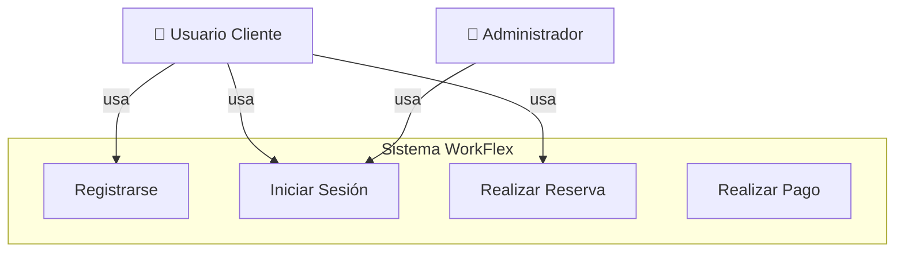

# 📚 Propuesta de Diseño - Sistema WorkFlex

> **Proyecto**: Plataforma Digital de Reservas y Gestión de Espacios de Coworking  
> **Cliente**: WorkFlex - Espacios de Coworking Inteligentes  
> **Asignatura**: Ingeniería de Software  
> **Fecha**: Noviembre 2025

---

## 📋 Tabla de Contenidos

- [Introducción](#introducción)
- [Estructura del Proyecto](#estructura-del-proyecto)
- [Documentación](#documentación)
  - [1. Análisis de Requisitos](#1-análisis-de-requisitos)
  - [2. Modelado UML](#2-modelado-uml)
  - [3. Modelado Conceptual](#3-modelado-conceptual)
  - [4. Prototipado y Mockups](#4-prototipado-y-mockups)
  - [5. Arquitectura y APIs](#5-arquitectura-y-apis)
- [Diagramas](#diagramas)
- [Entregables](#entregables)

---

## 🎯 Introducción

WorkFlex es una empresa que gestiona espacios de coworking en diferentes ciudades y busca mejorar la experiencia de sus clientes mediante una plataforma digital. Actualmente, la gestión se realiza mediante hojas de cálculo y correo electrónico, generando:

- ❌ Errores en la disponibilidad
- ❌ Sobrecarga administrativa
- ❌ Falta de trazabilidad

### Objetivos de la Solución

✅ Sistema centralizado de reservas  
✅ Gestión de membresías y accesos  
✅ Facturación y pagos en línea  
✅ Reportes y estadísticas de ocupación

---

## 📁 Estructura del Proyecto

```
Prog 2/
├── README.md                                    # Este archivo
├── trabajo                                      # Documento principal
│
├── 📊 Diagramas UML/
│   ├── 2 - Diagrama de casos de uso.mermaid
│   ├── 2 - Diagrama de clases.mermaid
│   └── 2 - Diagrama de secuencia.mermaid
│
├── 🗄️ Modelado Conceptual/
│   ├── 3 - Modelo Entidad Relacion.mermaid
│   ├── 3 - Patrones de diseño.md
│   └── 3 Arquitectura de capas.mermaid
│
├── 🎨 Prototipado/
│   ├── 4 - Flujos de usuario.mermaid
│   ├── 4 - Maoa de navegacino.mermaid
│   └── 4 - Pantallas principales.html
│
└── 🏗️ Arquitectura/
    ├── 5 - Arquitectura tecnica detallada.mermaid
    ├── 5 - Comparacion arquitecturas.md
    ├── 5 - Tecnologia usada.md
    └── 5-api-endpoints.md
```

---

## 📖 Documentación

### 1. Análisis de Requisitos

#### Requisitos Funcionales
- **RF1**: Gestión de Usuarios (registro, autenticación, perfiles)
- **RF2**: Gestión de Espacios (catálogo, disponibilidad, filtros)
- **RF3**: Sistema de Reservas (crear, modificar, cancelar, historial)
- **RF4**: Gestión de Membresías (tipos, privilegios, renovación)
- **RF5**: Sistema de Facturación y Pagos
- **RF6**: Reportes y Estadísticas
- **RF7**: Notificaciones

#### Requisitos No Funcionales
- **RNF1**: Rendimiento (< 2s respuesta, 1000 usuarios concurrentes)
- **RNF2**: Escalabilidad (preparado para 10-20 sedes)
- **RNF3**: Seguridad (encriptación, RGPD, JWT, PCI-DSS)
- **RNF4**: Disponibilidad (99.5% uptime)
- **RNF5**: Usabilidad (interfaz intuitiva, responsive)
- **RNF6**: Mantenibilidad (código documentado, testing > 80%)

#### Metodología de Gestión
**🏃 Scrum (Metodología Ágil)**

**Justificación**:
- ✅ Requisitos evolutivos (transformación digital)
- ✅ Entrega de valor temprana (MVP en 2-3 sprints)
- ✅ Feedback continuo del cliente
- ✅ Reducción de riesgo
- ✅ Flexibilidad ante cambios

**Sprints Propuestos** (2 semanas c/u):
- Sprint 0: Arquitectura base
- Sprint 1-2: MVP (login, catálogo, reserva básica)
- Sprint 3-4: Membresías y gestión de usuarios
- Sprint 5-6: Pagos y facturación
- Sprint 7-8: Dashboard y reportes
- Sprint 9: Testing y deployment

---

### 2. Modelado UML

#### 📊 Diagrama de Casos de Uso
Representa las interacciones principales entre usuarios y el sistema.

**Actores**:
- 👤 **Usuario Cliente**: Reserva espacios, gestiona perfil, realiza pagos
- 👨‍💼 **Administrador**: Gestiona espacios, usuarios, genera reportes
- 🏦 **Sistema de Pagos**: Pasarela externa (Stripe)

[Ver Diagrama de Casos de Uso](./2%20-%20Diagrama%20de%20casos%20de%20uso.mermaid)



#### 🏗️ Diagrama de Clases
Define las entidades clave y sus relaciones.

**Clases Principales**:
- `Usuario` (clase base) → `Cliente`, `Administrador`
- `Sede` → `Espacio` → `Reserva` → `Pago` → `Factura`
- `Membresía`, `Notificación`, `Reporte`

**Patrones de Diseño Aplicados**:
- Herencia: Usuario → Cliente/Administrador
- Composición: Pago usa PasarelaPago
- Repository Pattern para acceso a datos

[Ver Diagrama de Clases](./2%20-%20Diagrama%20de%20clases.mermaid)

#### 🔄 Diagrama de Secuencia
Ilustra el flujo de interacción para realizar una reserva.

**Flujo Principal**:
1. Cliente se autentica
2. Busca espacios disponibles
3. Verifica disponibilidad en tiempo real
4. Crea reserva (estado PENDIENTE)
5. **Alt A**: Tiene créditos → Confirma inmediatamente
6. **Alt B**: Requiere pago → Procesa con pasarela externa
7. Genera factura y envía confirmación

[Ver Diagrama de Secuencia](./2%20-%20Diagrama%20de%20secuencia.mermaid)

---

### 3. Modelado Conceptual

#### 🗄️ Modelo de Datos
[Ver Modelo Entidad-Relación](./3%20-%20Modelo%20Entidad%20Relacion.mermaid)

**Decisiones de Diseño**:
- **Class Table Inheritance**: Tablas separadas para USUARIOS, CLIENTES, ADMINISTRADORES
- **Campos JSON**: Flexibilidad para equipamiento, preferencias, notificaciones
- **Auditoría temporal**: created_at, updated_at, checkin_at, checkout_at
- **Soft deletes**: Campo `activo` en vez de eliminar registros

#### 🎨 Patrones de Diseño
[Ver Documento Completo de Patrones](./3%20-%20Patrones%20de%20diseño.md)

**Patrones Implementados** (14 patrones):

| Categoría | Patrón | Aplicación en WorkFlex |
|-----------|--------|------------------------|
| **Creacionales** | Factory Method | Creación de notificaciones (Email, SMS, Push) |
| | Builder | Construcción de reportes complejos |
| | Singleton | Gestor de configuración global |
| **Estructurales** | MVC | Arquitectura general del sistema |
| | Repository | Abstracción de acceso a datos |
| | Adapter | Integración de pasarelas de pago |
| | Decorator | Cálculo de precios con descuentos |
| **Comportamentales** | Strategy | Métodos de pago intercambiables |
| | Observer | Sistema de notificaciones |
| | State | Gestión de estados de reserva |
| | Command | Operaciones de reserva con undo/redo |
| | Chain of Responsibility | Validación de reservas |

**Principios SOLID Aplicados**:
- ✅ **S**ingle Responsibility
- ✅ **O**pen/Closed
- ✅ **L**iskov Substitution
- ✅ **I**nterface Segregation
- ✅ **D**ependency Inversion

#### 🏛️ Arquitectura en Capas
[Ver Diagrama de Arquitectura](./3%20Arquitectura%20de%20capas.mermaid)

**Capas del Sistema**:
1. **Presentación**: Web UI (React), Mobile App, Admin Dashboard
2. **API/Controllers**: Auth, Reservas, Espacios, Pagos, Admin
3. **Lógica de Negocio**: Services con reglas de negocio
4. **Acceso a Datos**: Repositories (abstracción de persistencia)
5. **Datos**: PostgreSQL + Redis (cache)
6. **Servicios Externos**: Stripe, SendGrid, Twilio, S3

---

### 4. Prototipado y Mockups

#### 🎨 Metodología de Prototipado
**Enfoque**: Prototipado Iterativo de Baja a Alta Fidelidad

**Fases**:
1. Sketches en papel (1-2 días)
2. Wireframes de baja fidelidad (3-5 días)
3. Wireframes de media fidelidad (5-7 días)
4. Mockups de alta fidelidad (7-10 días)
5. Prototipo interactivo (5 días)

**Herramienta Principal**: **Figma**
- ✅ Colaboración en tiempo real
- ✅ Componentes y design system
- ✅ Prototipado interactivo
- ✅ Handoff a desarrollo

#### 🖼️ Wireframes
[Ver Wireframes Interactivos](./4%20-%20Pantallas%20principales.html)

**Pantallas Principales**:
- Login/Registro
- Búsqueda de Espacios
- Detalle de Espacio
- Proceso de Reserva
- Panel de Usuario
- Dashboard Administrativo

#### 🗺️ Flujos de Usuario
[Ver Diagrama de Flujos](./4%20-%20Flujos%20de%20usuario.mermaid)

**Journey Map - Usuario Freelancer**:
1. **Descubrimiento**: Busca en Google "coworking bilbao"
2. **Exploración**: Navega por WorkFlex, ve opciones
3. **Evaluación**: Compara espacios, lee descripciones
4. **Decisión**: Selecciona sala, verifica disponibilidad
5. **Acción**: Completa reserva y pago
6. **Post-compra**: Recibe confirmación
7. **Uso**: Check-in digital
8. **Fidelización**: Considera membresía

#### 🧭 Mapa de Navegación
[Ver Mapa de Navegación](./4%20-%20Maoa%20de%20navegacino.mermaid)

**Estructura del Sitio**:
- Página Principal
  - Login/Registro
  - Búsqueda de Espacios → Reserva → Pago → Confirmación
  - Panel de Usuario → Mis Reservas, Mi Perfil, Mi Membresía
  - Panel Administrador → Dashboard, Gestión, Reportes

---

### 5. Arquitectura y APIs

#### 🏗️ Decisión Arquitectónica
[Ver Comparación Detallada](./5%20-%20Comparacion%20arquitecturas.md)

**Arquitectura Elegida**: **Modular Monolith (Híbrido)**

**Justificación**:
- ✅ Balance entre simplicidad y escalabilidad
- ✅ Time-to-market rápido (3-4 meses MVP)
- ✅ Costos operacionales bajos ($60-100/mes inicial)
- ✅ Preparado para migrar a microservicios cuando sea necesario
- ✅ Adecuado para equipo de 4-6 desarrolladores

**Comparativa**:

| Criterio | Monolito | Microservicios | **Híbrido** ✅ |
|----------|----------|----------------|----------------|
| Complejidad Inicial | Baja | Muy Alta | Media |
| Velocidad MVP | Rápida | Lenta | **Rápida** |
| Escalabilidad | Limitada | Excelente | Media → Alta |
| Costo Mensual | $50-100 | $500-1000 | **$100-200** |
| Tamaño Equipo | 2-5 | 10+ | **3-8** |

#### 💻 Stack Tecnológico
[Ver Stack Completo](./5%20-%20Tecnologia%20usada.md)

**Resumen del Stack**:

| Categoría | Tecnología | Justificación |
|-----------|-----------|---------------|
| **Frontend** | React + TypeScript + Tailwind | Ecosistema maduro, type safety |
| **Backend** | Node.js + Express + TypeScript | Full-stack JS, I/O performance |
| **Base de Datos** | PostgreSQL 15 | ACID, JSON support, open source |
| **Cache** | Redis 7 | In-memory, múltiples casos de uso |
| **ORM** | Prisma | Type-safe, migrations, DX excelente |
| **Autenticación** | JWT + bcrypt | Stateless, secure, estándar |
| **Pagos** | Stripe | Developer-friendly, compliance |
| **Email** | SendGrid | Gratuito para empezar, escalable |
| **Storage** | AWS S3 | Ilimitado, económico |
| **Monitoring** | Sentry + Prometheus/Grafana | Error tracking + métricas |
| **CI/CD** | GitHub Actions | Integrado, gratuito |
| **Hosting MVP** | DigitalOcean | $60/mes, simple, escalable |

#### 🔌 API REST
[Ver Endpoints Completos](./5-api-endpoints.md)

**Principios de Diseño**:
- ✅ Convenciones RESTful (GET, POST, PUT, PATCH, DELETE)
- ✅ Versionado: `/api/v1/`
- ✅ Autenticación: JWT Bearer tokens
- ✅ Rate limiting: 100-5000 requests/hora según rol
- ✅ Respuestas estandarizadas (success, data, error, metadata)

**Endpoints Principales** (~25 endpoints):

| Categoría | Endpoints | Ejemplos |
|-----------|-----------|----------|
| **Auth** | `/auth/register`, `/auth/login`, `/auth/refresh` | POST |
| **Usuarios** | `/users/me` | GET, PATCH |
| **Espacios** | `/spaces`, `/spaces/:id`, `/spaces/:id/availability` | GET |
| **Reservas** | `/reservations`, `/reservations/:id`, `/reservations/:id/checkin` | GET, POST, PATCH, DELETE |
| **Pagos** | `/payments`, `/payments/:id` | GET, POST |
| **Membresías** | `/memberships`, `/memberships/plans` | GET, POST, PATCH |
| **Admin** | `/admin/dashboard`, `/admin/reports/*` | GET, POST |

**Ejemplo de Endpoint**:

```json
GET /api/v1/spaces?sedeId=1&tipo=SALA_REUNIONES&capacidadMin=6

Response (200 OK):
{
  "success": true,
  "data": {
    "espacios": [
      {
        "id": 45,
        "nombre": "Sala Innovation",
        "tipo": "SALA_REUNIONES",
        "capacidad": 8,
        "precioPorHora": 25.00,
        "sede": {
          "nombre": "WorkFlex Bilbao Centro"
        },
        "equipamiento": ["Proyector", "Pizarra", "WiFi"],
        "disponible": true
      }
    ],
    "pagination": {
      "page": 1,
      "total": 45
    }
  }
}
```

#### 🏛️ Arquitectura Técnica Detallada
[Ver Diagrama Técnico](./5%20-%20Arquitectura%20tecnica%20detallada.mermaid)

**Componentes del Sistema**:
- **Clientes**: Web App (React), Mobile (React Native - Fase 2), Admin Panel
- **CDN**: Cloudflare CDN + AWS S3
- **API Gateway**: NGINX Load Balancer + Rate Limiting
- **Backend**: Modular Monolith con Express.js
  - Módulos: Auth, Reservas, Espacios, Pagos, Notificaciones, Reportes
- **Cache**: Redis (sesiones, queries)
- **Base de Datos**: PostgreSQL Master + Read Replica (Fase 2)
- **Servicios Externos**: Stripe, SendGrid, Twilio, Google Maps
- **Monitoring**: Winston, Prometheus, Grafana, Sentry
- **CI/CD**: GitHub + GitHub Actions + Docker

---

## 📊 Diagramas

Todos los diagramas están en formato Mermaid y pueden visualizarse directamente en GitHub:

### Diagramas UML
- [Diagrama de Casos de Uso](./2%20-%20Diagrama%20de%20casos%20de%20uso.mermaid)
- [Diagrama de Clases](./2%20-%20Diagrama%20de%20clases.mermaid)
- [Diagrama de Secuencia](./2%20-%20Diagrama%20de%20secuencia.mermaid)

### Modelado Conceptual
- [Modelo Entidad-Relación](./3%20-%20Modelo%20Entidad%20Relacion.mermaid)
- [Arquitectura en Capas](./3%20Arquitectura%20de%20capas.mermaid)

### Prototipado
- [Flujos de Usuario](./4%20-%20Flujos%20de%20usuario.mermaid)
- [Mapa de Navegación](./4%20-%20Maoa%20de%20navegacino.mermaid)
- [Wireframes Interactivos](./4%20-%20Pantallas%20principales.html) (abrir en navegador)

### Arquitectura
- [Arquitectura Técnica Detallada](./5%20-%20Arquitectura%20tecnica%20detallada.mermaid)

---

## 📦 Entregables

### Documento Principal
- [trabajo](./trabajo) - Documento completo de la propuesta (817 líneas)

### Documentos Complementarios
- [Patrones de Diseño](./3%20-%20Patrones%20de%20diseño.md) - 14 patrones explicados
- [Comparación de Arquitecturas](./5%20-%20Comparacion%20arquitecturas.md) - Análisis detallado
- [Stack Tecnológico](./5%20-%20Tecnologia%20usada.md) - Justificación de tecnologías
- [API Endpoints](./5-api-endpoints.md) - Especificación completa de la API REST

### Wireframes y Prototipos
- [Pantallas Principales](./4%20-%20Pantallas%20principales.html) - Wireframes interactivos en HTML

---

## 🎯 Conclusiones

### Decisiones Clave

1. **Metodología**: Scrum (ágil) por flexibilidad y entrega incremental
2. **Arquitectura**: Modular Monolith para balance costo-escalabilidad
3. **Stack**: Full-stack JavaScript (React + Node.js) para equipo unificado
4. **Base de Datos**: PostgreSQL por ACID y robustez
5. **Pagos**: Stripe por compliance y developer experience

### Beneficios Esperados

- ✅ **Time-to-market**: MVP en 3-4 meses
- ✅ **Costos**: $60-100/mes inicial, escalable según crecimiento
- ✅ **Escalabilidad**: Preparado para 10,000+ usuarios
- ✅ **Mantenibilidad**: Código limpio, testing automatizado, CI/CD
- ✅ **Seguridad**: Encriptación, JWT, compliance RGPD y PCI-DSS

### Próximos Pasos

1. **Aprobación del cliente**: Revisión de la propuesta
2. **Sprint 0**: Setup de infraestructura y CI/CD
3. **Sprint 1-2**: Desarrollo del MVP
4. **Testing con usuarios**: Validación de UX
5. **Lanzamiento**: Despliegue en producción

---

## 📞 Contacto

**Proyecto**: WorkFlex - Sistema de Gestión de Coworking  
**Asignatura**: Ingeniería de Software  
**Fecha**: Noviembre 2025

---

## 📄 Licencia

Este proyecto es un trabajo académico para la asignatura de Ingeniería de Software.

---

**Última actualización**: 22 de noviembre de 2025
